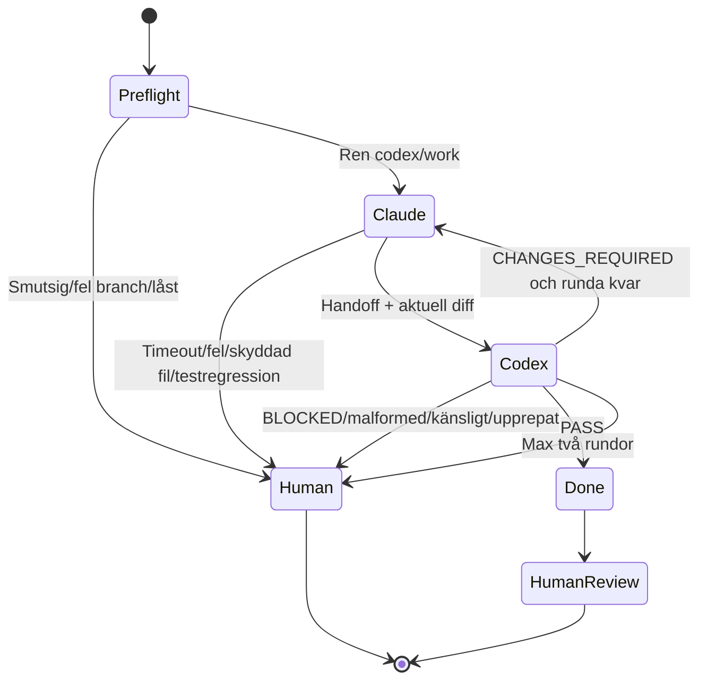

# Avgränsad Claude Code ↔ Codex-loop

> **VARNING:** Att två AI-agenter granskar varandra gör inte autonoma kodändringar säkra.
> Controllern begränsar tid, rundor och skrivbehörighet, men en människa måste fortfarande
> granska diffen, besluta om commit och ansvara för integration och release.

## Vad verktyget gör

`scripts/agent_loop.py` kör två kommandoradsverktyg sekventiellt i den befintliga
`/Users/Pontus/Documents/Projekt/Resus-codex`-arbetsytan:

1. Claude Code implementerar en avgränsad Markdown-task.
2. Controllern sparar Claudes korta handoff.
3. Codex granskar samma Git-diff i read-only-sandbox och returnerar schema-validerad JSON.
4. `PASS` stoppar loopen. `CHANGES_REQUIRED` ger Claude exakt en ny chans som standard.
5. `BLOCKED`, känsliga ändringar, upprepade fynd eller brutna säkerhetsgränser lämnas till en
   människa.

Inget extra worktree eller öppet editorfönster behövs. Arbetsytan är bara en katalog;
controllern startar båda CLI-processerna headless med den katalogen som `cwd`.

Controllern kör aldrig `git commit`, `merge`, `push`, `rebase`, branch-radering eller
deployment. Den återställer inte heller misslyckade ändringar automatiskt.



## Trafikljuset — så undviker du att förstöra något

### BLÅTT: förberedelse eller dry-run

Du får läsa och förbereda tasken. Inga agenter arbetar.

1. Kontrollera att ingen interaktiv Claude- eller Codex-session redigerar `Resus-codex`.
2. Kontrollera arbetsytan:

   ```bash
   git -C /Users/Pontus/Documents/Projekt/Resus-codex status --short
   git -C /Users/Pontus/Documents/Projekt/Resus-codex branch --show-current
   ```

   Status ska vara tom och branch ska vara `codex/work`.

3. Skapa runtime-tasken:

   ```bash
   mkdir -p /Users/Pontus/Documents/Projekt/Resus-codex/.agent-state
   cp /Users/Pontus/Documents/Projekt/Resus-codex/.agents/task.example.md \
     /Users/Pontus/Documents/Projekt/Resus-codex/.agent-state/task.md
   ```

4. Redigera bara `.agent-state/task.md`, som är ignorerad av Git.
5. Kör alltid dry-run först:

   ```bash
   python3 /Users/Pontus/Documents/Projekt/Resus-codex/scripts/agent_loop.py \
     --workspace /Users/Pontus/Documents/Projekt/Resus-codex \
     --task .agent-state/task.md \
     --dry-run
   ```

### GULT: agentloopen kör

Terminalen skriver exempelvis:

```text
[YELLOW] Runda 1/2: Claude arbetar. Rör inte Resus-codex.
[YELLOW] Runda 1/2: Codex granskar read-only.
```

Medan status är gul:

- öppna inte en ny implementeringsuppgift i `Resus-codex`;
- be inte Claude eller Codex ändra filer där;
- byt inte branch;
- stage:a, committa, återställ eller flytta inte filer;
- starta inte en andra agentloop.

Du får arbeta i andra kataloger, läsa webbplatsen och använda `main` för rent läsarbete, men
integrera ingenting från arbetsytan innan loopen är klar.

Låset ligger i `.agent-state/agent-loop.lock`. Att en låsfil finns betyder **stopp**. Ta inte
bort den manuellt om PID:n fortfarande lever.

### GRÖNT: PASS

```text
[GREEN] PASS. Agentloopen är klar; granska diffen innan commit.
```

Grönt betyder endast att Codex inte fann ett konkret fel. Gör därefter:

```bash
git -C /Users/Pontus/Documents/Projekt/Resus-codex status --short
git -C /Users/Pontus/Documents/Projekt/Resus-codex diff --check
git -C /Users/Pontus/Documents/Projekt/Resus-codex diff
```

Läs även:

- `.agent-state/claude-handoff.md`
- `.agent-state/codex-review.json`
- `.agent-state/state.json`

Först efter mänsklig granskning får en normal koordinator skapa commit och senare integrera
den i `main`. Controllern gör aldrig detta.

### RÖTT: stoppa och läs

Rött kan betyda `BLOCKED`, maxrundor, timeout, malformed review, skyddad fil, känslig ändring,
testregression, diffexplosion eller försök till rekursiv agentstart.

Gör inte en blind omkörning med `--allow-dirty`. Läs i stället:

```bash
git -C /Users/Pontus/Documents/Projekt/Resus-codex status --short
git -C /Users/Pontus/Documents/Projekt/Resus-codex diff
ls /Users/Pontus/Documents/Projekt/Resus-codex/.agent-state/logs
```

Välj sedan manuellt om diffen ska rättas, behållas eller återställas. Automatisk återställning
är avsiktligt förbjuden för att inte radera användararbete.

## Installation och CLI-förutsättningar

Python 3.10+ och Git krävs. Inga Python-paket installeras.

Claude Code måste vara installerat, autentiserat och tillgängligt som `claude`, eller anges
med en absolut sökväg:

```bash
python3 scripts/agent_loop.py \
  --workspace /Users/Pontus/Documents/Projekt/Resus-codex \
  --task .agent-state/task.md \
  --claude-bin /full/path/to/claude
```

Claude Code använder dokumenterade headless-flaggor: `-p`, `--output-format text`,
`--max-turns` och `--permission-mode acceptEdits`. Se
[Anthropics CLI-referens](https://docs.anthropic.com/en/docs/claude-code/cli-usage).

Codex måste stödja:

- `codex exec`
- `--sandbox read-only`
- `--ask-for-approval never`
- `--ephemeral`
- `--output-schema`

Implementationen verifierades mot `codex-cli 0.146.0-alpha.3.1`. Den installerade Claude
CLI:n saknades i PATH när verktyget byggdes; fake-executable-tester verifierar därför
adapterns processkontrakt, medan första riktiga körningen även måste bekräfta `claude --help`.

Kontrollera före första riktiga körningen:

```bash
claude --help
codex --version
codex exec --help
```

## Normal användning

```bash
python3 scripts/agent_loop.py \
  --workspace /Users/Pontus/Documents/Projekt/Resus-codex \
  --task .agent-state/task.md \
  --max-rounds 2
```

Viktiga alternativ:

- `--claude-bin` och `--codex-bin`: executable-namn eller absoluta sökvägar.
- `--claude-timeout` och `--codex-timeout`: tidsgränser i sekunder.
- `--max-output-bytes`: separat fångstgräns för stdout och stderr.
- `--allow-dirty`: explicit undantag för en redan granskad smutsig arbetsyta; alla andra
  skydd gäller fortfarande.
- `--dry-run`: validera och visa kommandon utan agentstart.
- `--verbose`: visar agentkommandon, diffstorlek och träffade känslighetsregler utan att
  skriva ut hela prompts eller transkript.

Det finns ingen flagga som stänger av alla säkerhetskontroller.

## Filkommunikation

Spårade filer:

```text
.agents/
  task.example.md
  review-schema.json
  safety-rules.json
  prompts/
    claude-implementer.txt
    codex-reviewer.txt
scripts/agent_loop.py
tests/test_agent_loop.py
docs/agent-loop.md
```

Ignorerad runtime:

```text
.agent-state/
  task.md
  state.json
  claude-handoff.md
  codex-review.json
  agent-loop.lock
  nested-agent-attempt.log
  logs/
```

Agenterna skriver inte runtime-state direkt. Claude returnerar en begränsad Markdown-handoff
via stdout och Codex returnerar en JSON-review via stdout. Controllern validerar och sparar
dem atomiskt. Gamla fullständiga transkript skickas aldrig in i nästa prompt; endast
ursprungstasken och olösta strukturerade fynd används.

## Review-format

```json
{
  "status": "CHANGES_REQUIRED",
  "summary": "Ett konkret fel återstår.",
  "findings": [
    {
      "id": "stable-finding-id",
      "severity": "medium",
      "file": "relative/path.js",
      "line": 123,
      "problem": "Konkret defekt eller risk.",
      "required_fix": "Specifik korrigering."
    }
  ]
}
```

`PASS` kräver tom `findings`. `CHANGES_REQUIRED` kräver minst ett fynd. Okända properties,
absoluta filsökvägar, dubblett-ID:n och ogiltiga statusvärden stoppas.

## Säkerhetsmodell

Controllern:

- kräver rätt katalognamn och `codex/work`;
- vägrar normalt en smutsig arbetsyta;
- använder `subprocess` utan `shell=True`;
- låser arbetsytan med atomisk `O_EXCL`;
- sätter `RESUS_AGENT_LOOP_ACTIVE=1` mot rekursion;
- skuggar `claude`, `codex` och `agent_loop.py` för barnprocesser;
- begränsar tid och fångad output;
- stoppar vid ändringar i controller, schema, prompts och koordinationsfiler;
- kör Codex med read-only-sandbox och efterkontrollerar att diffen inte ändrades;
- stoppar vid fler än konfigurerat antal filer/rader;
- stoppar vid identisk review, kvarstående finding-ID, testregression eller kraftig diffökning;
- flaggar auth, behörigheter, hemligheter, betalning, migrering, deployment, kryptografi och
  destruktiva datamönster för mänsklig granskning;
- skriver state atomiskt och lämnar bounded loggar.

Reglerna finns samlat i `.agents/safety-rules.json`.

Codex får läsa task, handoff, diff och berörda filer genom sin read-only-sandbox. Claude får
redigera arbetskopian, men förbjuds i prompt och CLI-regler att använda Git-releasekommandon
eller starta agenter. Om en oförutsedd behörighetsfråga inte kan besvaras non-interaktivt ska
agenten misslyckas och controllern stanna.

## Känsliga ändringar

Känsliga ändringar får granskas men kan aldrig ge slutligt automatiskt grönt resultat.
Controllern returnerar exitkod 12 och `human_review_sensitive`, även om Codex svarar `PASS`.
Det finns ingen “ignorera allt”-flagga.

## Exitkoder

| Kod | Betydelse |
|---:|---|
| 0 | PASS eller lyckad dry-run |
| 10 | Maxrundor med olösta fynd |
| 11 | Codex BLOCKED |
| 12 | Mänsklig granskning krävs, exempelvis känsliga ändringar |
| 13 | Säkerhetsbarriär utlöst |
| 14 | Agent saknas, timeout eller processfel |
| 15 | Malformed handoff/review/schema |
| 16 | Smutsig arbetsyta utan explicit undantag |
| 17 | Arbetsytan är redan låst |
| 130 | Avbruten med tangentbordssignal |

## Exempel på lyckad körning

```text
[YELLOW] Runda 1/2: Claude arbetar. Rör inte Resus-codex.
[YELLOW] Runda 1/2: Codex granskar read-only.
[GREEN] PASS. Agentloopen är klar; granska diffen innan commit.
```

En andra tillåten körväg:

```text
[YELLOW] Runda 1/2: Claude arbetar. Rör inte Resus-codex.
[YELLOW] Runda 1/2: Codex granskar read-only.
[YELLOW] Runda 2/2: Claude arbetar. Rör inte Resus-codex.
[YELLOW] Runda 2/2: Codex granskar read-only.
[GREEN] PASS. Agentloopen är klar; granska diffen innan commit.
```

## Återhämtning efter avbrott

Normala fel och `Ctrl-C` frigör låset genom en context manager. Vid strömavbrott kan låsfilen
bli kvar. Nästa körning läser PID:n och återtar automatiskt endast ett bevisligen dött lås.

Om låset säger att PID:n lever: stoppa. Ta inte bort låset. Kontrollera processen först.

Efter alla avbrott ligger källändringarna kvar. Läs state, loggar och Git-diff. Controllern
använder aldrig `git reset`, `git clean` eller automatisk filradering.

## Uppdatera CLI-adaptrar

Alla versionsspecifika argument finns i två funktioner i `scripts/agent_loop.py`:

- `build_claude_command`
- `build_codex_command`

När en CLI ändras:

1. Läs den installerade `--help`.
2. Uppdatera endast motsvarande adapter.
3. Behåll Codex read-only, non-interactive approvals och schema-output.
4. Behåll Claude non-interactive och Git-/agentförbud.
5. Kör hela fake-executable-testsviten.
6. Kör dry-run.
7. Gör en manuellt övervakad, ofarlig pilot innan verkliga uppgifter.

## Begränsningar

- Prompts och executable-skuggning minskar risken för rekursiva agentstarter men utgör inte
  ett komplett operativsystemssandbox för Claude.
- `--allow-dirty` kan inte säkert avgöra vilka tidigare ändringar som är “relaterade”; använd
  det bara efter mänsklig granskning.
- Testregression bygger på Claudes obligatoriska `TEST_STATUS`, inte på en oberoende
  testrunner.
- Känslighetsregler är konservativa nyckelord och kan ge både falska positiva och missar.
- Read-only-säkerheten för Codex beror på installerad CLI-version och efterkontrolleras därför
  även med Git.
- Controllern gör ingen commit och kan inte avgöra om en godkänd diff bör release:as.

Loopen är avsiktligt liten och begränsad. Den ska stoppa för ofta hellre än att försöka vara
en generell autonom fleragentsplattform.
