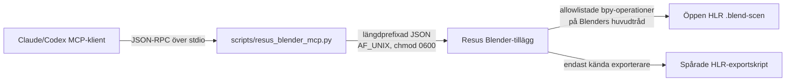

# Resus Blender MCP

Resus Blender MCP låter en MCP-klient inspektera och justera de spårade HLR-scenerna
interaktivt i en redan öppen Blender. Lösningen är lokal, dependency-free och medvetet
begränsad. Den ersätter inte de reproducerbara generatorerna eller exportörerna.

> **Varning:** MCP gör inte 3D-ändringar automatiskt säkra. Granska verktygsanrop, spara en
> snapshot före större förändringar och kontrollera alltid Git-diffen efter export.

## Arkitektur



MCP-servern startas automatiskt av klienten via `.mcp.json`. Blender-tillägget startas
manuellt i den öppna scenen och skapar
`.agent-state/resus-blender.sock` i just den arbetskopian. `.agent-state/` är redan ignorerad.

## Säkerhetsmodell

- Endast Unix-socket i projektet; ingen TCP-port och ingen fjärråtkomst.
- Socketen får filrättighet `0600`.
- Endast öppna `.blend`-filer under `HLR/blender/` godtas.
- Inget verktyg för fri Python, shell, paketinstallation eller nätverksnedladdning.
- Inga användarstyrda filsökvägar.
- Rendering sker till en intern temporärfil som tas bort efter svaret.
- Snapshots hamnar i den ignorerade `.agent-state/blender-snapshots/`.
- Källfilssparning kräver `confirm_source_save=true`.
- Export kräver `confirm_export=true`, en sparad scen och ett exakt filnamn i den fasta
  exporterarmappningen.
- Alla numeriska transform- och renderparametrar har hårda gränser.
- Blenders API anropas på huvudtråden; sockettråden får inte mutera scenen direkt.

De enda exportkombinationerna är:

| Scen | Exporterare |
|---|---|
| `hlr-room.blend` | `export_hlr_layout.py` |
| `hlr-staff-rig.blend` | `export_hlr_staff_rig.py` |
| `hlr-patient-rig.blend` | `export_hlr_patient_rig.py` |
| `hlr-equipment-details.blend` | `export_hlr_equipment_details.py` |

## Installation i Blender

1. Öppna Blender 4.3 eller senare.
2. Välj **Edit → Preferences → Add-ons**.
3. Klicka pilmenyn uppe till höger och välj **Install from Disk…**.
4. Välj `HLR/blender/resus_blender_mcp_addon.py`.
5. Aktivera tillägget **Interface: Resus Blender MCP**.
6. Öppna en spårad scen, exempelvis `HLR/blender/hlr-patient-rig.blend`.
7. Öppna 3D-vyns sidopanel med **N**, välj fliken **Resus MCP** och klicka **Starta Resus MCP**.
8. Starta om Claude/Codex efter ändringen av `.mcp.json`, eller ladda om MCP-servrarna i
   klientens inställningar.

Blender kopierar tilläggsfilen till sin användarmapp vid installation. Installera därför om
tillägget från den spårade filen efter en framtida uppdatering av
`resus_blender_mcp_addon.py`.

Serverstatus ska därefter visa den aktuella arbetskopian och scenfilen. Om både `main` och
`codex/work` används måste Blender öppna filen från samma arbetskopia som MCP-klienten kör i.
Varje arbetskopia har sin egen socket och kan därför inte råka styra den andra.

## Tillgängliga verktyg

- `resus_blender_status`
- `resus_blender_list_objects`
- `resus_blender_get_object`
- `resus_blender_select_object`
- `resus_blender_set_transform`
- `resus_blender_set_visibility`
- `resus_blender_set_material`
- `resus_blender_list_actions`
- `resus_blender_apply_action`
- `resus_blender_render_preview`
- `resus_blender_save_scene`
- `resus_blender_export_current`

## Rekommenderat arbetssätt

1. Kontrollera status och läs objektet innan det ändras.
2. Skapa en snapshot.
3. Gör en liten transform eller materialändring.
4. Rendera en preview och låt användaren bedöma resultatet.
5. Fortsätt i små steg. Använd deltaförflyttning endast när den är avsiktlig.
6. Spara till källfilen först efter uttryckligt godkännande.
7. Kör den fasta exporteraren.
8. Granska `git status`, diffen och de genererade filerna.
9. Kör modulens vanliga verifiering innan commit eller push.

Exempel på säkra instruktioner:

```text
Lista objekten vars namn innehåller "doctor".
Skapa en snapshot.
Flytta doctor 0,1 Blender-enheter åt vänster i delta-läge.
Rendera en preview på 900 × 680.
```

## Fel och återställning

- **Tillägget är inte startat:** öppna rätt `.blend`, gå till **Resus MCP** och klicka Starta.
- **Fel arbetskopia:** stäng scenen och öppna samma filsökväg som klientens projektrot.
- **Gammal socket:** tillägget provar socketen och tar bara bort den om ingen server svarar.
- **Blender har hängt sig under rendering:** stoppa/starta tillägget efter att Blender svarar.
- **Oönskad ändring:** stäng utan att spara eller öppna senaste snapshot från
  `.agent-state/blender-snapshots/`.
- **Exporteraren vägrar:** spara scenen, kontrollera exakt `.blend`-filnamn och försök igen.

Tillägget autostartar inte. Det är en avsiktlig spärr: användaren ska kunna se vilken scen som
är öppen innan en agent får tillgång till den.
